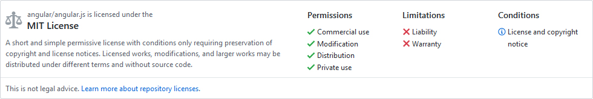

# Licenses
basic information about open-source, well-known, widely used licenses etc...

## Useful links:
 - [choosealicense.com/](https://choosealicense.com/)
 - [opensource.org/licenses/category](https://opensource.org/licenses/category)
 - [opensource.org/faq](https://opensource.org/faq)

## Choose a license:
 - I want it simple and permissive: **MIT**
 - I’m concerned about patents: **Apache License 2.0**
 - I care about sharing improvements: **GNU GPLv3**

**MIT:** permissive license that is short and to the point. It lets people do anything they want with your code as long as they provide attribution back to you and don’t hold you liable. Examples: [jQuery](https://github.com/jquery/jquery/blob/master/LICENSE.txt), [.NET Core](https://github.com/dotnet/corefx/blob/master/LICENSE.TXT), [Rails](https://github.com/rails/rails/blob/master/activerecord/MIT-LICENSE), [Twitter Bootstrap](https://github.com/twbs/bootstrap/blob/v4-dev/LICENSE)

**Apache License 2.0:** permissive license similar to the MIT License, but also provides an express grant of patent rights from contributors to users. Examples: [Elasticsearch](https://github.com/elastic/elasticsearch/blob/master/LICENSE.txt), [Kubernetes](https://github.com/kubernetes/kubernetes/blob/master/LICENSE), [Swift](https://github.com/apple/swift/blob/master/LICENSE.txt)

**GNU GPLv3:** copyleft license that requires anyone who distributes your code or a derivative work to make the source available under the same terms, and also provides an express grant of patent rights from contributors to users. Examples: [BASH](https://git.savannah.gnu.org/cgit/bash.git/tree/COPYING), [GIMP](https://git.gnome.org/browse/gimp/tree/COPYING), [Privacy Badger](https://github.com/EFForg/privacybadgerfirefox/blob/master/LICENSE)

## Permissive? Copyleft?
from Wikipedia:
> A **permissive software license**, sometimes also called BSD-like or BSD-style license, is a free software software licence with minimal requirements about how the software can be redistributed. Examples include the MIT Licence, BSD licences, Apple Public Source License and the Apache licence. As of 2016, the most popular free software license is the permissive MIT license.

> **Copyleft** (a play on the word *copyright*) is the practice of offering people the right to freely distribute copies and modified versions of a work with the stipulation that the same rights be preserved in derivative works down the line. Copyleft software licenses are considered protective or reciprocal, as contrasted with permissive free software licenses.

>Copyleft is a form of licensing, and can be used to maintain copyright conditions for works ranging from computer software, to documents, to art, to scientific discoveries and instruments in medicine.
 - In general, **copyright** law is used by an author to prohibit recipients from reproducing, adapting, or distributing copies of their work.
 - In contrast, under **copyleft**, an author may give every person who receives a copy of the work permission to reproduce, adapt, or distribute it, with the accompanying requirement that any resulting copies or adaptations are also bound by the same licensing agreement.

>Copyleft licenses for software require that information necessary for reproducing and modifying the work must be made available to recipients of the binaries. The source code files will usually contain a copy of the license terms and acknowledge the authors.

from: opensource.org
>Most copyleft licenses are Open Source, but not all Open Source licenses are copyleft. When an Open Source license is not copyleft, that means software released under that license can be used as part of programs distributed under other licenses, including proprietary (non-open-source) licenses. For example, the BSD license is a non-copyleft Open Source license. Such licenses are usually called either "non-copyleft" or "permissive" open source licenses

## Some terms...
 - **Intellectual property rights (IPRs)** are the rights granted to the creators of IP, and include trademarks, *copyright*, patents, industrial design rights, and in some jurisdictions trade secrets. Artistic works including music and literature, as well as discoveries, inventions, words, phrases, symbols, and designs can all be protected as intellectual property.
 - **Copyright** is a legal right created by the law of a country that grants the creator of an original work exclusive rights for its *use* and *distribution*. This is usually only for a limited time.
 - [What's the difference between Copyright and Licensing?](https://opensource.stackexchange.com/questions/297/whats-the-difference-between-copyright-and-licensing) **Copyright** is the legal term used to declare and prove who owns the intellectual property (the code, text, etc.). **Licensing** is the legal term used to describe the terms under which people are allowed to use the copyrighted material.

## No-license, but source code is public on Github
Short answer: **all rights are reserved**. See:
 - [Is my code FLOSS just because it is published it on GitHub?](https://opensource.stackexchange.com/questions/1150/is-my-code-floss-just-because-it-is-published-it-on-github)
 - [What can I assume if a publicly published project has no license?](https://opensource.stackexchange.com/questions/1720/what-can-i-assume-if-a-publicly-published-project-has-no-license)

## How can I determine if two open source licenses are compatible with each other?
source: [opensource.stackexchange.com](https://opensource.stackexchange.com/questions/1/how-can-i-determine-if-two-open-source-licenses-are-compatible-with-each-other)

## Examples from Github repos
The following print-screens are from the official github repositories and include a short description of each license, together with their `Permissions`, `Limitations` and `Conditions` sections.

### Angular

### Prometheus

### Linux

## Appendix
image from [choosealicense.com/appendix/](https://choosealicense.com/appendix/):

